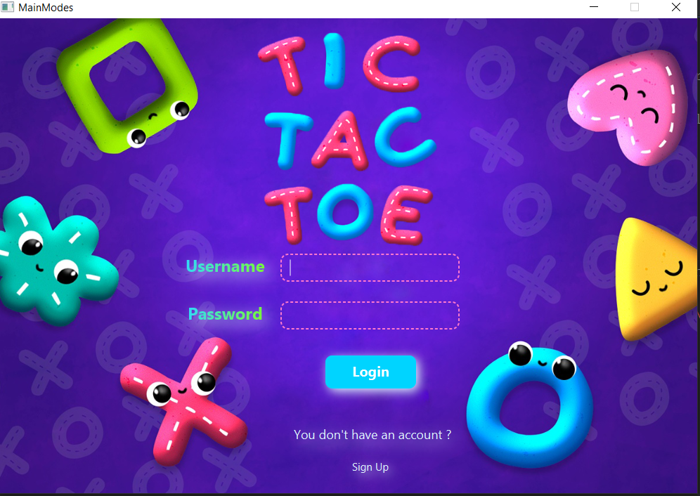
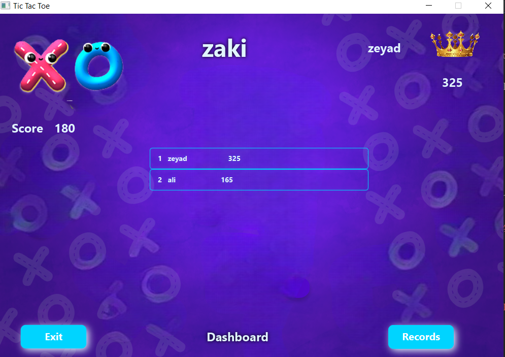
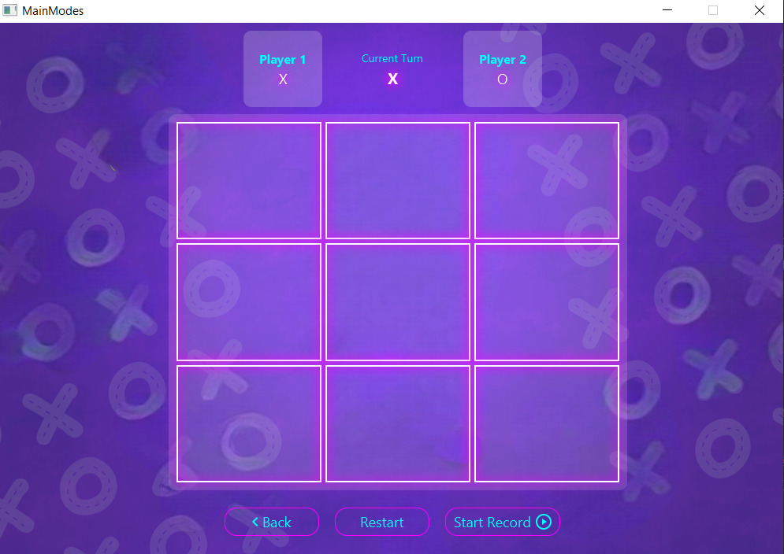
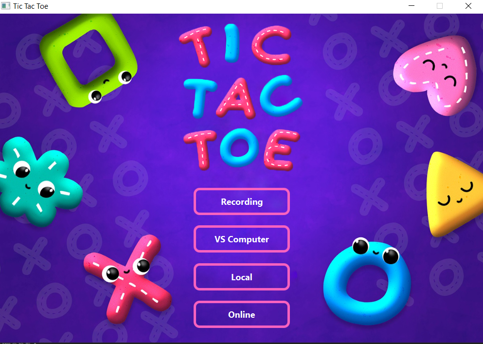
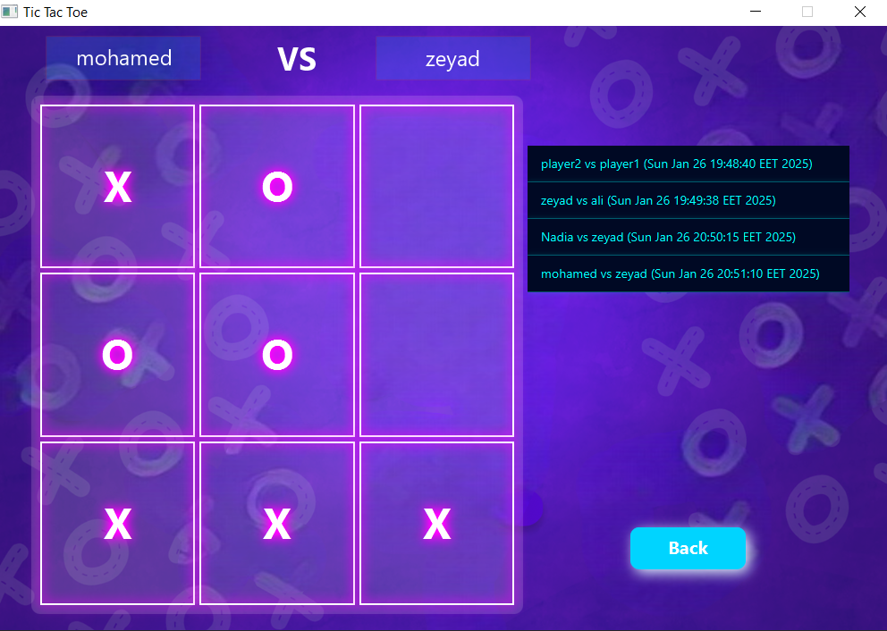

# [TicTacToe City Light]  
## [Network Based TicTacToe Game]  

### Description  
[Welcome to Tic Tac Toe Game! This game is designed with JavaFX and provides a fun and interactive gaming experience.]
---

## Features  

### Gameplay  
- **Single Player Mode**: Play against the computer with varying difficulty levels powered by AI.  
- **Multiplayer Mode**: Play locally on the same machine or over a network with friends.  
- **Online Mode**:  
  - View a list of available players online.  
  - Send play requests to other players.  
  - Accept or decline game requests seamlessly.  

### Additional Functionalities  
- **Game Recording**: Record gameplay and store it for replaying later.  
- **Reward System**: Win bonus videos as rewards for victories.  
- **Player Scoring**: Player scores are stored and tracked.  

### User Management  
- Register and log in to the server.  
- Maintain a personalized profile and scores.  

### Server Features  
- Handles database transactions, connections, and data exchange between players.  
- Provides a GUI for server management with features like:  
  - Start/Stop service buttons.  
  - Graphs displaying the number of active, online, and offline users.  

---

## Screenshots  

Example:  
  

---

## How It Works  

### Setup Instructions  
1. **Install Java**: Make sure Java is installed on your machine.  
2. **Set Up an IDE**: Use an IDE like NetBeans or IntelliJ IDEA to load the project files.  
3. **Network Setup**: Ensure a proper network configuration for multiplayer functionality.  

---

## Technologies Used  
- JavaFX for the user interface and graphics.  
- Sockets Networking for online and multiplayer functionalities.  
- Derby Database for managing user data and scores.  

---

## Contributors  
  
- **[Nadia Farid](https://github.com/NadiaFarid799)**  
- **[Suhaila Farahat](https://github.com/Suhaila-Farahat)**  
- **[Mahmoud Adel](https://github.com/mahmoud126d)**  
- **[Mohammed Hussien](https://github.com/MohammedHussien10)**

---

## Prerequisites  
- Java installed on your machine.  
- IDE (NetBeans).  
- Stable network setup for multiplayer functionality.  

---

Enjoy playing and exploring **Tic Tac Toe Game**! 🎮

